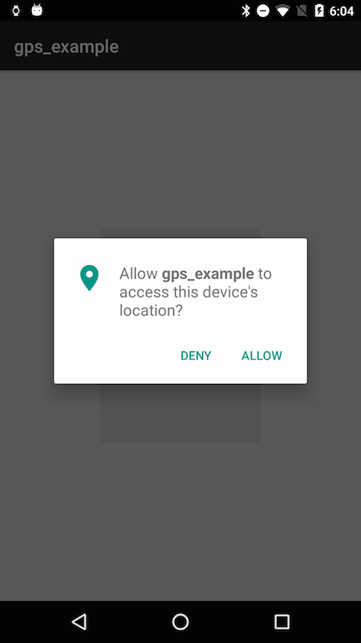

# Android guidelines
## Location Services
As the Driving Engine SDK requires location permissions, a message stating the need for its use should be displayed. 
  
"Allow **APP NAME** to access this device's location?"
  

