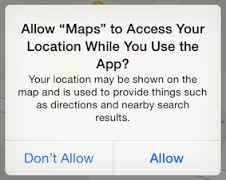

# iOS guidelines
## Location Services
As the Driving Engine SDK requires location permissions, a message stating the need for its use should be displayed. 
  
"We would like to use your location "
  

